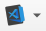

## Настройка окружения
### Установка модуля
1. Клонировать репозиторий(ветка master)
2. Сформировать zip-архив из полученного проекта
3. Установить модуль в QGIS: 
   + Модули > Управление и установка модулей > Install from ZIP > выбор созданного zip-архива
### Debug
1. Найти и открыть проект(модуль) по пути: ```C:\Users\username\AppData\Roaming\QGIS\QGIS3\profiles\default\python\plugins\gisles-for-qgis```
2. В корне проекта отредактировать под себя файл `vs_code_for_qgis.bat` (Заменить пути, если необходимо).
3. Запускать VS Code для разработки и тестирования необходимо через `vs_code_for_qgis.bat`
4. В QGIS установить плагин `debugvs`:
   + Модули > Управление и установка модулей > Все > debugvs > Install plugin 
   + В панели инструментов появиться иконка 
5. Создать файл конфигураций `launch.json` (Вкладка Run and Debug в VS Code(Python: Remote Attach)). Содержимое файла:
   ```json
      {
          "version": "0.2.0",
          "configurations": [
              {
                  "name": "Python: Remote Attach",
                  "type": "python",
                  "request": "attach",
                  "connect": {
                      "host": "localhost",
                      "port": 5678
                  },
                  "pathMappings": [
                      {
                          "localRoot": "${workspaceFolder}",
                          "remoteRoot": "${workspaceFolder}"
                      }
                  ],
                  "justMyCode": true
              }
          ]
      }
   ```
6. Простовить брейкпоинты на необходимых участках кода
7. В QGIS: плагин `debugvs`: Enable debug for Visual Studio
8. Запустить debug в VS Code (Вкладка Run and Debug)
    

# trial_area
Создание пробной площади

Установка модуля:
Установить QGIS-OSGeo4W-3.10.11-1-Setup-x86_64.exe
Установить postgresql-12.4-1-windows-x64 (postgresql-12.4-1-windows-x64.exe --mode unattended --servicepassword loo98Yt5)
Установить POstGIS
Применить Postgis
pg_restore -h localhost -U postgres -d trial_area file.gz
Скачать с репозитория ветку master и добавить модуль через Install from zip

---

При пустой таблице area не будет работать
надо болванку одну туда записать

---
